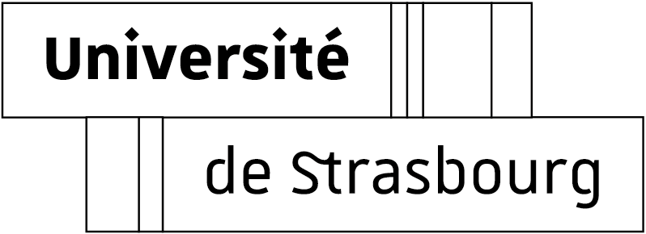

---
# Feel free to add content and custom Front Matter to this file.
# To modify the layout, see https://jekyllrb.com/docs/themes/#overriding-theme-defaults

layout: home
title: Home
---

Research interests: optimization, control, inverse problems and numerical analysis.

<video 
    src="https://github.com/user-attachments/assets/6a772bfd-8aba-4727-966b-aee7984c3bfb" 
    controls="controls" muted="muted"
    style="height:240px; width: 480px">
</video>

#  Contact 
Institut de Recherche Mathématique Avancée ([IRMA](https://irma.math.unistra.fr/))  
7 Rue René Descartes,  
67000 Strasbourg, France.  
Office 226 at [UFR](https://mathinfo.unistra.fr/) de Mathématiques-Informatique.

